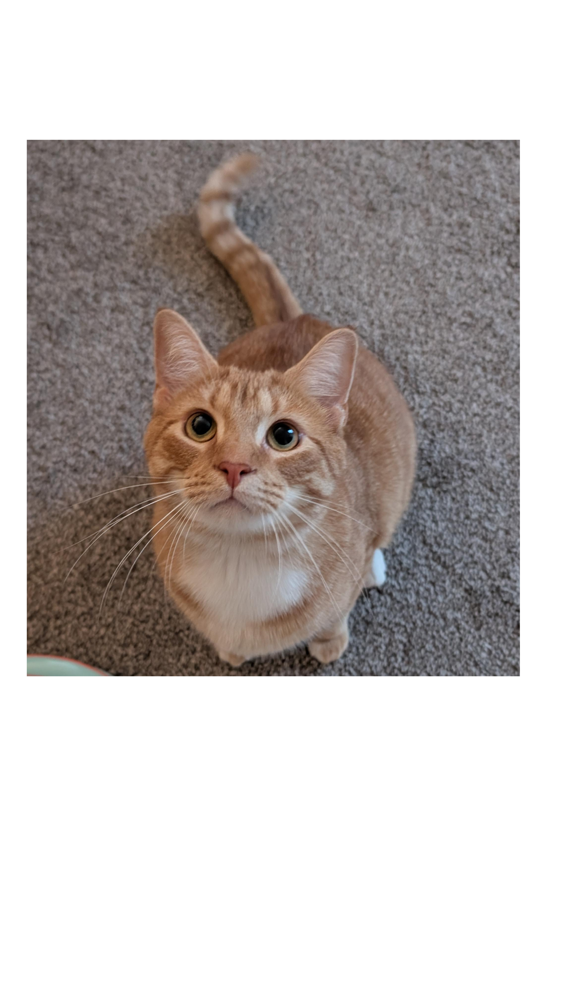

<p align="center">
  
</p>

<div align="center">

```
╔══════════════════════════════════════════════════════════════════╗
║  AYUSH_BHOSALE.exe                                    [RUNNING]  ║
╚══════════════════════════════════════════════════════════════════╝
```


</div>

<br>

<div align="center">


</div>

<br>

```bash
ayush@devbox:~$ cat about.txt
```

> Software and AI/ML Engineer, passionate about full-stack development and
> Data Science. Focused on the intersection of AI, data, and software
> engineering.

<br>

```bash
ayush@devbox:~$ ls ./certifications/
```

<div align="center">

| NAME | RESOURCE_LINK |
| :--- | :--- |
| `Deeplearning` | [Deeplearning.ai](https://www.deeplearning.ai/) |

</div>

<br>

```bash
ayush@devbox:~$ ls ./ai_research_and_architectures/
```

<div align="center">

| PROJECT | FOCUS / TOOLS | LINK |
| :--- | :--- | :--- |
| `Transformers` | Encoder-Decoder, Self-Attention | [repo_link](https://github.com/AyushBhosale/transformers) |
| `Embeddings_from_scratch` | Vectorization, Semantic Mapping | [repo_link](https://github.com/AyushBhosale/Embeddings-from-scratch) |

</div>

<br>

```bash
ayush@devbox:~$ ps --status=running
```

<div align="center">

| PROJECT | TOOLS | STATUS |
| :--- | :--- | :--- |
| `WingWoman` | React, FastAPI | 🟡 `IN_PROGRESS` |

</div>

<br>

```bash
ayush@devbox:~$ ls ./genai_and_finetuning/
```

<div align="center">

| PROJECT | TOOLS | LINK |
| :--- | :--- | :--- |
| `Finetuning_Gemma` | Keras | [notebook](https://github.com/Rays-Medico/finetunningGemma) |
| `Syra` | Streamlit, Groq-Api | [repo](https://github.com/AyushBhosale/Syra) |
| `Kulwadi_Bhushan` | Langchain, Ollama | [notebook](https://www.kaggle.com/code/ayushbhosale/kulwadi-bhushan) |
| `RAG` | Langchain, Faiss, Azure | [repo](https://github.com/AyushBhosale/Rag) |

</div>

<br>

```bash
ayush@devbox:~$ ls ./data_science_and_deep_learning/
```

<div align="center">

| PROJECT | TOOLS | LINK |
| :--- | :--- | :--- |
| `Skin-Cancer` | CNN, Tensorflow | [notebook](https://www.kaggle.com/code/ayushbhosale/skin-cancer-with-tensorflow-and-cnn/edit) |
| `Movie_Recommendation` | NLTK, Sklearn | [repo](https://github.com/AyushBhosale/MovieRecomendationSystem) |
| `Syra-RNN` | Tensorflow | [notebook](https://www.kaggle.com/code/ayushbhosale/chatbotfinal) |
| `Apple-EDA` | Seaborn | [repo](https://github.com/AyushBhosale/Apple-EDA) |

</div>

<br>

```bash
ayush@devbox:~$ ls ./full_stack_projects/ --deployed
```

<div align="center">

| PROJECT | TOOLS | LINK |
| :--- | :--- | :--- |
| `Peppo` | React, FastAPI, Docker | [Live](https://frontend-pepo-latest.onrender.com) |
| `Syra` | Streamlit, Azure | [Live](https://syra-gfe2b6hcchcpbsha.canadacentral-01.azurewebsites.net/) |
| `CurioBot` | React, FastAPI | [Video](https://youtu.be/wFK7jofEwAY) |
| `Rays-Medico` | Django, Tensorflow | [repo](https://github.com/Rays-Medico/raysWebsite) |

</div>

<br>

```bash
ayush@devbox:~$ cat /proc/toolchain/languages_and_tools
```

<div align="center">


</div>

<br>

```bash
ayush@devbox:~$ ./connect.sh --open-socket
```

<div align="center">

[](https://www.linkedin.com/in/ayush-bhosale-207ba7250/)
[](mailto:ayushbhosale7997@gmail.com)
[](https://www.instagram.com/ayush._.bhosale/)

</div>

<br>

<div align="center">

```
╔══════════════════════════════════════════════════════════════════╗
║  [ END OF FILE ]   process exited with code 0   █▌               ║
╚══════════════════════════════════════════════════════════════════╝
```

</div>
